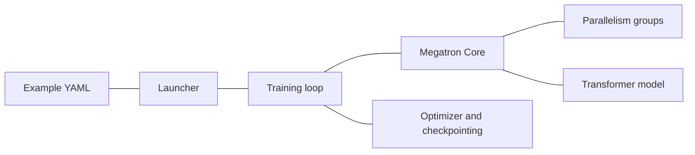

# Megatron Explorer Guide

This generated guide links the visual explorer back to Megatron-LM source, docs, and example configs.


## Megatron-LM and Megatron Core

_Source: `README.md`_

Megatron-LM and Megatron Core
=============================


[](https://docs.nvidia.com/megatron-core/developer-guide/latest/index.html)
[](./CHANGELOG.md)
[](./LICENSE)


## About

This repository contains two components: **Megatron-LM** and **Megatron Core**.

**Megatron-LM** is a reference example that includes Megatron Core plus pre-configured training scripts. Best for research teams, learning distributed training, and quick experimentation.

**Megatron Core** is a composable library with GPU-optimized building blocks for custom training frameworks. It provides transformer building blocks, advanced parallelism strategies (TP, PP, DP, EP, CP), mixed precision support (FP16, BF16, FP8, FP4), and model architectures. Best for framework developers and ML engineers building custom training pipelines.

**[Megatron Bridge](https://github.com/NVIDIA-NeMo/Megatron-Bridge)** provides bidirectional Hugging Face ↔ Megatron checkpoint conversion with production-ready recipes.

## Getting Started

**Install from PyPI:**

```bash
uv pip install megatron-core
```

**Or clone and install from source:**

```bash
git clone https://github.com/phi9t/megatronlm.git
cd Megatron-LM
uv pip install -e .
```

> **Note:** Building from source can use a lot of memory. If the build runs out of memory, limit parallel compilation jobs by setting `MAX_JOBS` (e.g. `MAX_JOBS=4 uv pip install -e .`).

For NGC container setup and all installation options, see the **[Installation Guide](https://docs.nvidia.com/megatron-core/developer-guide/latest/get-started/install.html)**.

- **[Your First Training Run](https://docs.nvidia.com/megatron-core/developer-guide/latest/get-started/quickstart.html)** - End-to-end training examples with data preparation
- **[Parallelism Strategies](https://docs.nvidia.com/megatron-core/developer-guide/latest/user-guide/parallelism-guide.html)** - Scale training across GPUs with TP, PP, DP, EP, and CP
- **[Contribution Guide](https://docs.nvidia.com/megatron-core/developer-guide/latest/developer/contribute.html)** - How to contribute to Megatron Core

# Latest News

- **[2026/03]** **Deprecating Python 3.10 support:** We're officially dropping Python 3.10 support with the upcoming 0.17.0 release. Downstream applications must raise their lower boundary to 3.12 to stay compatible with MCore.
- **[2026/01]** **[Dynamic Context Parallelism](https://developer.nvidia.com/blog/speeding-up-variable-length-training-with-dynamic-context-parallelism-and-nvidia-megatron-core/)** - Up to 1.48x speedup for variable-length sequence training with adaptive CP sizing.
- **[2025/12]** **Megatron Core development has moved to GitHub!** All development and CI now happens in the open. We welcome community contributions.
- **[2025/10]** **[Megatron Dev Branch](https://github.com/phi9t/megatronlm/tree/main)** - early access branch with experimental features.
- **[2025/10]** **[Megatron Bridge](https://github.com/NVIDIA-NeMo/Megatron-Bridge)** - Bidirectional converter for interoperability between Hugging Face and Megatron checkpoints, featuring production-ready recipes for popular models.
- **[2025/08]** **[MoE Q3-Q4 2025 Roadmap](https://github.com/phi9t/megatronlm/issues/1729)** - Comprehensive roadmap for MoE features including DeepSeek-V3, Qwen3, advanced parallelism strategies, FP8 optimizations, and Blackwell performance enhancements.
- **[2025/08]** **[GPT-OSS Model](https://github.com/phi9t/megatronlm/issues/1739)** - Advanced features including YaRN RoPE scaling, attention sinks, and custom activation functions are being integrated into Megatron Core.
- **[2025/06]** **[Megatron MoE Model Zoo](https://github.com/yanring/Megatron-MoE-ModelZoo)** - Best practices and optimized configurations for training DeepSeek-V3, Mixtral, and Qwen3 MoE models with performance benchmarking and checkpoint conversion tools.
- **[2025/05]** Megatron Core v0.11.0 brings new capabilities for multi-data center LLM training ([blog](https://developer.nvidia.com/blog/turbocharge-llm-training-across-long-haul-data-center-networks-with-nvidia-nemo-framework/)).


# Project Structure

```
Megatron-LM/
├── megatron/
│   ├── core/                    # Megatron Core (kernels, parallelism, building blocks)
│   │   ├── models/              # Transformer models
│   │   ├── transformer/         # Transformer building blocks
│   │   ├── tensor_parallel/     # Tensor parallelism
│   │   ├── pipeline_parallel/   # Pipeline parallelism
│   │   ├── distributed/         # Distributed training (FSDP, DDP)
│   │   ├── optimizer/           # Optimizers
│   │   ├── datasets/            # Dataset loaders
│   │   ├── inference/           # Inference engines and server
│   │   └── export/              # Model export (e.g. TensorRT-LLM)
│   ├── training/                # Training scripts
│   ├── legacy/                  # Legacy components
│   ├── post_training/           # Post-training (quantization, distillation, pruning, etc.)
│   └── rl/                      # Reinforcement learning (RLHF, etc.)
├── examples/                    # Ready-to-use training examples
├── tools/                       # Utility tools
├── tests/                       # Comprehensive test suite
└── docs/                        # Documentation
```

# Performance Benchmarking

For our latest performance benchmarking results, please refer to [NVIDIA Megatron Bridge Performance Summary](https://docs.nvidia.com/nemo/megatron-bridge/latest/performance-summary.html).

Our codebase efficiently trains models from 2B to 462B parameters across thousands of GPUs, achieving up to **47% Model FLOP Utilization (MFU)** on H100 clusters.


## Project Architecture

_Source: `docs/get-started/overview.md`_

# Overview

Megatron-Core and Megatron-LM are open-source tools that are typically used together to train LLMs at scale across GPUs. Megatron-Core expands the capability of Megatron-LM. Megatron Bridge connects Megatron-Core and Megatron-LM to other popular training models, such as Hugging Face.

## Megatron Core

NVIDIA Megatron Core is a library of essential building blocks for highly efficient large-scale generative AI training. It can be used to train models with high throughput at scale across thousands of GPUs. It provides an extensive set of tools for multimodal and speech AI. It expands Megatron-LM capabilities.

Megatron-Core contains GPU-optimized techniques featuring advanced parallelism strategies, optimizations like FP8 training, and support for the latest LLM, MoE, and multimodal architectures. It abstracts these techniques into composable and modular APIs.

Megatron-Core is compatible with all NVIDIA Tensor Core GPUs and popular LLM architectures such as GPT, BERT, T5, and RETRO.


**Composable library** with GPU-optimized building blocks for custom training frameworks.

**Best for:**

- **Framework developers** building on top of modular and optimized components
- **Research teams** needing custom training loops, optimizers, or data pipelines
- **ML engineers** requiring fault-tolerant training pipelines

**What you get:**

- Composable transformer building blocks (attention, MLP)
- Advanced parallelism strategies (TP, PP, DP, EP, CP)
- Pipeline schedules and distributed optimizers
- Mixed precision support (FP16, BF16, FP8)
- GPU-optimized kernels and memory management
- High-performance dataloaders and dataset utilities
- Model architectures (LLaMA, Qwen, GPT, Mixtral, Mamba)

## Megatron-LM

Megatron-LM is a reference implementation, with a lightweight large-scale LLM training framework. It offers a customizable native PyTorch training loop with fewer abstraction layers. It was designed for scaling transformer models to the multi-billion and trillion-parameter regimes under realistic memory and compute constraints. **It serves as a direct entry point for exploring Megatron-Core.**

It uses advanced parallelization techniques including model parallelism (tensor and pipeline), to allow models with billions of parameters to fit and train across large GPU clusters. It enables breakthroughs in large-scale NLP tasks. It splits model computations across many GPUs, overcoming single-GPU memory limits for training huge models, like GPT-style transformers.

**Reference implementation** that includes Megatron Core plus everything needed to train models.

**Best for:**

- **Training large foundation models** at scale with strong performance on the latest NVIDIA hardware
- **Research teams** exploring new architectures and training techniques
- **Learning distributed training** concepts and best practices
- **Quick experimentation** with proven model configurations

**What you get:**

- Pre-configured training scripts for GPT, LLaMA, DeepSeek, Qwen, and more.
- End-to-end examples from data prep to evaluation
- Research-focused tools and utilities


## Megatron Bridge

Megatron Bridge provides out-of-the-box bridges and training recipes for models built on top of base model architectures from Megatron Core.  

Megatron Bridge provides a parallelism-aware pathway to convert models and checkpoints. This bidirectional converter performs on-the-fly, model-parallel-aware, per-parameter conversion, and full in-memory loading.

After training or modifying a Megatron model, you can convert it again for deployment or sharing. Refer to the [Megatron Bridge repository](https://github.com/NVIDIA-NeMo/Megatron-Bridge) for the code and training recipes.

## Ecosystem Libraries

**Libraries used by Megatron Core:**

- **[Megatron Energon](https://github.com/NVIDIA/Megatron-Energon)** - Multi-modal data loader (text, images, video, audio) with distributed loading and dataset blending
- **[Transformer Engine](https://github.com/NVIDIA/TransformerEngine)** - Optimized kernels and FP8 mixed precision support
- **[Resiliency Extension (NVRx)](https://github.com/NVIDIA/nvidia-resiliency-ext)** - Fault tolerant training with failure detection and recovery

**Libraries using Megatron Core:**

- **[Megatron Bridge](https://github.com/NVIDIA-NeMo/Megatron-Bridge)** - Training library with bidirectional checkpoint conversion between Hugging Face and Megatron, customizable training loops, and production-ready recipes
- **[NeMo RL](https://github.com/NVIDIA-NeMo/RL)** - Scalable toolkit for efficient reinforcement learning with RLHF, DPO, and other post-training methods
- **[NeMo Framework](https://docs.nvidia.com/nemo-framework/user-guide/latest/overview.html)** - Enterprise framework with cloud-native support and end-to-end examples
- **[Model Optimizer (ModelOpt)](https://github.com/NVIDIA/Model-Optimizer)** - Model optimization toolkit for quantization, pruning, distillation, speculative decoding, and more. Check out end-to-end examples in [examples/post_training/modelopt](https://github.com/phi9t/megatronlm/tree/main/examples/post_training/modelopt).

**Compatible with:** [Hugging Face Accelerate](https://github.com/huggingface/accelerate), [Colossal-AI](https://github.com/hpcaitech/ColossalAI), [DeepSpeed](https://github.com/microsoft/DeepSpeed)

## Parallelism Strategies

_Source: `docs/user-guide/parallelism-guide.md`_

# Parallelism Strategies Guide

Megatron Core supports multiple parallelism strategies that can be combined to efficiently train models from billions to trillions of parameters across thousands of GPUs.

## Overview

The following table summarizes supported parallelism strategies.

| Strategy | Parallelism Objective | Best For |
|----------|---------------------|----------|
| **Data Parallelism (DP)** | Batch Dimension | Data Scalability, Standard Training |
| **Tensor Parallelism (TP)** | Individual Layers | Large Layers & Activation, GPU Memory Constraints |
| **Pipeline Parallelism (PP)** | Model Depth | Very Deep Models |
| **Context Parallelism (CP)** | Sequence Length | Long Sequences (8K+ Tokens) |
| **Expert Parallelism (EP)** | MoE Experts | Mixture-of-Experts Models |
| **Fully-Sharded Data Parallelism (Megatron-FSDP)** | Model State | Extremely Large Models & DP Interchangeability |

## Data Parallelism (DP)

### Standard Distributed Data Parallel (DDP)

Replicate the model across GPUs and split the batch.

```bash
torchrun --nproc_per_node=8 pretrain_gpt.py \
    --data-parallel-sharding-strategy no_shard
```

Each GPU has a full copy of the model and processes a portion of the batch.

### Megatron Fully-Sharded Data Parallel (Megatron-FSDP)

Shard model parameters, gradients, and optimizer states across GPUs to reduce memory utilization.

```
--use-megatron-fsdp
--data-parallel-sharding-strategy optim_grads_params
--ckpt-format fsdp_dtensor
--init-model-with-meta-device
```

**Sharding Strategies**

`--data-parallel-sharding-strategy` supports the following options:

- `optim` - Shard optimizer states only (ZeRO-1)
- `optim_grads` - Shard gradients + optimizer (ZeRO-2)
- `optim_grads_params` - Shard parameters + gradients + optimizer (ZeRO-3)

If `--num-distributed-optimizer-instances` is > 1, then hierarchical data parallelism is enabled.

`--outer-dp-sharding-strategy` supports the following options:

- `no_shard` (**Hybrid-Sharded Data Parallelism**) - Replicate the model state across outer data parallel ranks.
- `optim` (**Hybrid-FSDP**) - Shard the optimizer state across the outer data parallel ranks.
  - Requires `--data-parallel-sharding-strategy optim_grads_params`.

**When to Use**

- Large models with large or fused compute kernels to hide communications under.
- Integrated with TP, CP, EP, and easily composable with heterogeneous parallelisms.
- With SM-reducing optimizations from NCCL and activation offloading from TransformerEngine.
- Using `fully_shard` without depending on Megatron-LM.

## Tensor Parallelism (TP)

Split individual model layers across GPUs. Recommended for large hidden dimensions.

```bash
--tensor-model-parallel-size 4  # 4-way tensor parallelism
--sequence-parallel              # Enable sequence parallelism (recommended)
```

**When to Use**

- Model layers do not fit on a single GPU
- Large hidden dimensions (4096+)
- Usually combined with DP and PP

## Pipeline Parallelism (PP)

Split model layers across GPUs vertically (by depth).

```bash
--pipeline-model-parallel-size 8              # 8 pipeline stages
--num-layers-per-virtual-pipeline-stage 4     # Virtual pipeline for load balancing
```

**When to Use**

## Ultra-Scale Playbook Mapping

_Source: `docs/ultra-scale-playbook/megatron-mapping.md`_

# Ultra-Scale Playbook to Megatron-LM Mapping

Use this page as the Megatron-LM companion to the Ultra-Scale Playbook. The
Playbook explains why a scaling technique exists; this page shows where the same
idea appears in Megatron config, launcher code, and implementation code.

Each section follows the same path:

1. **Playbook idea:** the resource tradeoff.
2. **Megatron config:** a compact YAML or flag-style excerpt.
3. **Megatron code:** short source snippets that show where the decision is made.
4. **Source trail:** collapsible navigation for the next files to inspect.

The local Llama launcher is the easiest first anchor:
[`examples/llama/llama_config.py`](https://github.com/phi9t/megatronlm/blob/main/examples/llama/llama_config.py)
turns YAML presets under
[`examples/llama/configs/`](https://github.com/phi9t/megatronlm/tree/main/examples/llama/configs)
into Megatron CLI arguments. Core Megatron argument validation lives in
[`megatron/training/yaml_arguments.py`](https://github.com/phi9t/megatronlm/blob/main/megatron/training/yaml_arguments.py).

## One-GPU Training and Batch Math

**Playbook idea:** start with the single-device training loop, then separate
the per-GPU microbatch from the global training batch. More accumulation raises
the global batch without increasing activation memory for one forward/backward
microbatch.

**Megatron config:**

```yaml
training:
  micro_batch_size: 1
  global_batch_size: 1
  train_iters: 2
parallelism:
  tensor_model_parallel_size: 1
  pipeline_model_parallel_size: 1
data:
  mode: mock
```

Source: [`examples/llama/configs/llama_anchor_smoke.yaml`](https://github.com/phi9t/megatronlm/blob/main/examples/llama/configs/llama_anchor_smoke.yaml#L21-L40).

**Megatron code:**

```python
add_arg(args, "--micro-batch-size", self.micro_batch_size)
add_arg(args, "--global-batch-size", self.global_batch_size)
add_arg(args, "--train-iters", self.train_iters)
add_arg(args, "--train-samples", self.train_samples)
```

Why this matters: the Llama YAML keeps the Playbook batch symbols visible, then
renders them to the exact Megatron flags consumed by the training loop.

Source: [`TrainingConfig.to_args()`](https://github.com/phi9t/megatronlm/blob/main/examples/llama/llama_config.py#L223-L230).

```python
if args.global_batch_size is None:
    args.global_batch_size = args.micro_batch_size * args.data_parallel_size
    if args.rank == 0:
        print('setting global batch size to {}'.format(
            args.global_batch_size), flush=True)
assert args.global_batch_size > 0
```

Why this matters: if the user does not set a global batch, Megatron defaults it
to one microbatch per data-parallel rank.

Source: [`yaml_arguments.py`](https://github.com/phi9t/megatronlm/blob/main/megatron/training/yaml_arguments.py#L103-L118).


## Data Parallelism and Gradient Accumulation

**Playbook idea:** DP replicates model state and splits the batch. Gradient
accumulation reuses the same model replica for several microbatches before an
optimizer step, so the effective batch is `micro_batch_size * data_parallel_size
* gradient_accumulation_steps`.

**Megatron config:**

```yaml
distributed:
  nproc_per_node: 8
training:
  micro_batch_size: 1
  global_batch_size: 128
parallelism:
  tensor_model_parallel_size: 1
  pipeline_model_parallel_size: 1
  context_parallel_size: 1
```

## Mixture of Experts

_Source: `docs/user-guide/features/moe.md`_

# Mixture of Experts

```{toctree}
:maxdepth: 1
:caption: MoE Features

multi_token_prediction
multi_latent_attention
../../api-guide/router_replay
```

```{include} ../../../megatron/core/transformer/moe/README.md
```

## Multi-Latent Attention

_Source: `docs/user-guide/features/multi_latent_attention.md`_

# Multi-Latent Attention

## Multi-Latent Attention Overview

Multi-Latent Attention (MLA) is an attention variant from the DeepSeek team. It uses multiple latent spaces to change how attention is computed. That design often lowers cost for large language models (LLMs) compared with standard attention and can shrink the KV cache. The DeepSeek-V2 technical report compares MLA to Multi-Head Attention (MHA) on quality and cache size.

## Enabling Multi-Latent Attention

To enable MLA in Megatron-LM, set the following on the command line:

- `--multi-latent-attention` to turn on MLA.
- Use `MLATransformerConfig` for MLA-specific model settings when you build the training configuration.

## Megatron FSDP

_Source: `docs/user-guide/features/megatron_fsdp.md`_

# Megatron-FSDP

## ✨ Overview

**Megatron-FSDP** is an NVIDIA-developed distributed parallelism library written in native PyTorch that provides a high-performance implementation of **Fully Sharded Data Parallelism (FSDP)**. It offers seamless cross-compatibility with various deep learning frameworks and parallelism libraries such as Megatron-Core, and is performance-optimized to support training and inference of extremely large PyTorch models at data-center scale on NVIDIA GPUs.

- PyPI: https://pypi.org/project/megatron-fsdp/
- Source Code: https://github.com/phi9t/megatronlm/tree/main/megatron/core/distributed/fsdp/src

### 🧩 Compatibility

- PyTorch **[DeviceMesh](https://docs.pytorch.org/docs/2.11/distributed.html#torch.distributed.device_mesh.DeviceMesh)**, **[DTensor](https://docs.pytorch.org/docs/stable/distributed.tensor.html)**, and **[Distributed Checkpoint (DCP)](https://docs.pytorch.org/docs/stable/distributed.checkpoint.html)**
- **[Megatron Core](https://github.com/phi9t/megatronlm)**
- **[TransformerEngine](https://github.com/NVIDIA/TransformerEngine)**
- **[NVIDIA NeMo Framework Container](https://catalog.ngc.nvidia.com/orgs/nvidia/containers/nemo)**

### 💡 Features

- **Performant & Scalable**: Optimized for NVIDIA CUDA with efficient memory management and performance. Sports near-linear scaling up from single compute nodes to entire data-centers.
- **Multiple Algorithms in One**: Supports sharding your choice of optimizer states, gradients, and model parameters (FSDP), including hierarchical data parallelism strategies such as **Hybrid-Sharded Data Parallelism (HSDP)** and **Hybrid-FSDP (HFSDP / Fully-Sharded Optimizer State)** for optimizing intra-node and inter-node memory, communication, and performance.
- **"Bring Your Own Parallelism"**: Works seamlessly with PyTorch, Megatron-LM, Megatron-Bridge, and TransformerEngine, and can be plugged into other frameworks such as HuggingFace Transformers and TorchTitan.
- **Simple & Powerful**: Similar to PyTorch FSDP, the `fully_shard` API doesn't depend on any complex training framework or distributed environment.

### ⏱️ Optimizations

- **[TransformerEngine](https://github.com/NVIDIA/TransformerEngine) Mixed-Precision & Fused Kernels**: Native performance- and memory-optimal _compatibility with MXFP8, NVFP4, and various other quantization recipes and fused kernels provided by TransformerEngine_.
- **Advanced Bucketing**: `dtype`-customizable and precision-aware bucketing system to _tune the memory overhead, numerical accuracy, and latency of collectives_. Avoids redundant `COPY` operations before and after collectives, while remaining compatible with **[DTensor](https://docs.pytorch.org/docs/stable/distributed.tensor.html)** features such as **[Torch Distributed Checkpoint (DCP)](https://docs.pytorch.org/docs/stable/distributed.checkpoint.html)**.
- **Buffer Management**: Efficient use of storage and [NCCL User Buffer Registration](https://docs.nvidia.com/deeplearning/nccl/user-guide/docs/usage/bufferreg.html#user-buffer-registration) enable _direct communication into NCCL-managed memory_, achieving true zero-`COPY` data movement. Introduced in NCCL `v2.27`, **NCCL Symmetric Memory** communications employ _symmetric kernels_ that drastically reduce SM utilization and include networking optimizations such as high-precision (`FP32`) reduction over-the-wire.
- **Optimized Communication & SM Utilization via SHARP**: Leverages [**SHARP** (Scalable Hierarchical Aggregation and Reduction Protocol)](https://docs.nvidia.com/networking/display/sharpv3130) to _offload FSDP collectives to network switches (InfiniBand or NVLink-Switch)_ and significantly reduce utilization of GPU streaming multi-processors (SM) from 16-32 to 1-6 for **Multi-Node NVLink (MNNVL)** systems (Grace-Blackwell, Vera-Rubin, etc.), which lowers communication latency in large scaled-out workloads and frees up GPU-hosted processors for overlapped compute (GEMM) kernels. When FSDP sharding domains span both NVLink and InfiniBand, **hierarchical SHARP collectives** (NVL-SHARP and IB-SHARP) _optimize communication paths across the entire system topology_.
- [**Hybrid-FSDP (HFSDP)**](#understanding-hybrid-fsdp-hfsdp), a variation of _Hybrid-Sharded Data Parallelism (HSDP)_ that further shards the optimizer state across intra- and inter-node data-parallel ranks, _bridges the memory-communication trade-off between HSDP and FSDP_, unlocking memory efficiency at minimal cost to performance.

## 🚀 Quick Start

### 📦 Installation

#### NeMo Framework Container

Megatron-FSDP is pre-installed with Megatron-Core in the [NVIDIA NeMo Framework Container](https://catalog.ngc.nvidia.com/orgs/nvidia/containers/nemo/tags).

#### Megatron-Core

Megatron-FSDP is bundled with Megatron-Core, which can be installed via `pip`:

```
# Install via PyPI
pip install --no-build-isolation megatron-core[mlm,dev]

# Install from Source
git clone https://github.com/phi9t/megatronlm.git
cd Megatron-LM
pip install --no-build-isolation .[mlm,dev]
```

To import Megatron-FSDP in Python:
```python
import megatron.core.distributed.fsdp.src.megatron_fsdp
```

#### PyPI

To install Megatron-FSDP as a standalone package to use the `fully_shard` API:

```
pip install megatron-fsdp
```

To import Megatron-FSDP in Python:

```python
import megatron_fsdp
```

### 🎛️ Megatron-FSDP `fully_shard`

Megatron-FSDP supports a simple `fully_shard` API that seamlessly enables FSDP with very few lines of code.

```python
import torch
from megatron_fsdp import (
    fully_shard_model,
    fully_shard_optimizer,
)

# Initialize Torch Distributed.
torch.distributed.init_process_group()
torch.cuda.set_device(torch.distributed.get_rank())

# Fully-shard the model.
model = torch.nn.Transformer()
fsdp_model = fully_shard_model(
    module=model,
    fsdp_unit_modules=[
        torch.nn.TransformerEncoder,
        torch.nn.TransformerDecoder
    ]
)

# Fully-shard the optimizer.
toy_adam = torch.optim.AdamW(params=fsdp_model.parameters(), lr=0.01)
optimizer = fully_shard_optimizer(optimizer=toy_adam)

# Forward pass.
inp = torch.randn(1, 512, 512).to("cuda")
tgt = torch.randn(1, 512, 512).to("cuda")
output = fsdp_model(inp, inp)

# Backward pass.
torch.nn.functional.mse_loss(output, tgt).backward()

# Optimizer step.
optimizer.step()
optimizer.zero_grad()

# Checkpoint the model and optimizer.
torch.distributed.checkpoint.save({
    "model": fsdp_model.state_dict(),
    "optimizer": optimizer.state_dict(),
}, checkpoint_id="ckpt/")

# Load the saved checkpoint.
ckpt = {
    "model": fsdp_model.state_dict(),
    "optimizer": optimizer.state_dict(),
}
torch.distributed.checkpoint.load(state_dict=ckpt, checkpoint_id="ckpt/")
fsdp_model.load_state_dict(ckpt["model"], strict=False)
optimizer.load_state_dict(ckpt["optimizer"])
```

## Context Parallelism

_Source: `docs/user-guide/features/context_parallel.md`_

# Context Parallel Package

## Context Parallelism Overview

```{figure} ../../images/context_parallel/CP_overview.png
:alt: Diagram of a transformer layer with tensor parallelism 2 and context parallelism 2, showing CP and TP communication patterns around attention and other blocks.
:align: center

Figure 1: A transformer layer running with TP2CP2. Communications next to Attention are for CP, others are for TP. (AG/RS: all-gather in forward and reduce-scatter in backward, RS/AG: reduce-scatter in forward and all-gather in backward, /AG: no-op in forward and all-gather in backward).
```

Context Parallelism (CP) is a parallelization scheme on the sequence-length dimension. Unlike prior SP (sequence parallelism), which only splits the sequence of Dropout and LayerNorm activations, CP partitions the network inputs and all activations along the sequence dimension. With CP, all modules except attention (for example, Linear and LayerNorm) can work as usual without any changes, because they do not have inter-token operations. For attention, the Q (query) of each token must combine with the KV (key and value) of all tokens in the same sequence. CP therefore requires an additional all-gather across GPUs to collect the full sequence of KV. Correspondingly, reduce-scatter is applied to the activation gradients of KV in backward propagation. To reduce activation memory footprint, each GPU stores only the KV of a sequence chunk in forward and gathers KV again in backward. KV communication happens between a GPU and its counterparts in other TP groups. The all-gather and reduce-scatter are implemented as point-to-point communications in a ring topology. Exchanging KV can also leverage MQA or GQA to reduce communication volume, because those variants use one or a few attention heads for KV.

For example, in Figure 1, if the sequence length is 8K, each GPU processes 4K tokens. GPU0 and GPU2 form a CP group and exchange KV with each other; the same pattern applies between GPU1 and GPU3. CP is similar to [Ring Attention](https://arxiv.org/abs/2310.01889) but targets higher performance by (1) using current open-source and cuDNN flash attention kernels, and (2) avoiding extra work from lower-triangle causal masking while keeping load balanced across GPUs.

## Context Parallelism Benefits

```{figure} ../../images/context_parallel/CP_results.png
:alt: Chart of speedup for 175B GPT with different tensor parallelism and context parallelism combinations compared with full activation recomputation.
:align: center

Figure 2: Speedup of 175B GPT with various TP+CP combinations compared to full recomputation (that is, TP8CP1).
```

An LLM can hit an out-of-memory (OOM) error on long contexts (long sequence lengths) because activation memory grows about linearly with sequence length. Recomputing activations in backward can avoid OOM but adds significant overhead (about 30 percent with full recomputation). Increasing TP (tensor model parallelism) can also fix OOM, but it can make compute in layers such as Linear too short to hide communication latency. Scaling to more GPUs with larger TP can hit that overlap limit even when OOM is not the driver.

CP addresses these tradeoffs. With CP, each GPU computes on part of the sequence, which scales down both compute and communication by the CP degree. Overlap between them is less of a concern. The activation memory footprint per GPU is also smaller by the CP degree, which reduces OOM risk. As Figure 2 shows, TP and CP together can outperform full recomputation by removing most recompute overhead and balancing compute against communication.

## Enabling Context Parallelism

CP support is included on the GPT code path. Other models that share that path, such as LLaMA, can use CP as well. CP works with TP (tensor model parallelism), PP (pipeline model parallelism), and DP (data parallelism). The total GPU count is TP × CP × PP × DP. CP also works with different attention variants, including MHA, MQA, and GQA, with unidirectional or bidirectional masking.

Enable CP by setting `context_parallel_size=<CP_SIZE>` on the command line. The default `context_parallel_size` is 1, which disables CP. Running with CP requires Megatron Core (>=0.5.0) and Transformer Engine (>=1.1).
