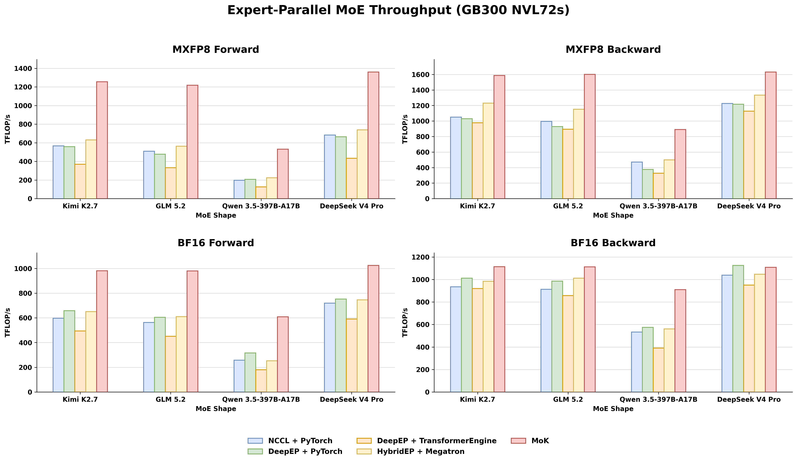

# Mixture-of-Kittens (MoK)

Mixture-of-Kittens (MoK) is a fully deterministic mixture-of-experts (MoE) training megakernel built from first principles for NVL72s. MoK fuses all MoE computation and communication into a single kernel, overlapping compute and inter-GPU networking at configurable granularity, and fully eliminates CPU-GPU synchronization. It supports BF16 and MXFP8, covers both forward and backward passes, and powers production training of Composer at Cursor.

For a deep dive, read our [blog post](https://cursor.com/blog/mixture-of-kittens).

## Performance

We evaluated MoK at two levels: standalone MoE layers, with all benchmark code available in [`benchmarks`](./benchmarks), and end-to-end training on our internal production stack across multiple NVL72 racks. The following figure summarizes the standalone MoE layer benchmarks:



Compared with the fastest baseline, MoK is up to 2.37x faster for the MXFP8 forward, 1.78x for the MXFP8 backward, 1.92x for the BF16 forward, and 1.58x for the BF16 backward.

See our [blog post](https://cursor.com/blog/mixture-of-kittens) for the methodology and full results.

## Setup

### Requirements

- NVIDIA Blackwell SM100 or SM103 GPUs (e.g., GB200 NVL72 or GB300 NVL72)
- Python 3.12 or later
- PyTorch 2.10 or later
- CUDA toolkit 13.0 or later

### PyTorch and CUDA

The installed PyTorch build must target CUDA 13.0+, and its CUDA version must match the major and minor version of the system CUDA toolkit. MoK is built and tested against CUDA 13.0, but later versions should work as well.

For example, to install PyTorch 2.10 built against CUDA 13.0:

```bash
python -m pip install "torch==2.10.0+cu130" --index-url https://download.pytorch.org/whl/cu130
```

### Installation

By default, MoK builds for SM103. Install from the repository root with either:

```bash
pip install . --no-build-isolation
```

or:

```bash
python setup.py install
```

To build for SM100 instead, set the `MOK_ARCH` environment variable:

```bash
MOK_ARCH=SM100 pip install . --no-build-isolation
```

To verify the installation:

```bash
python -c "import mok; print(mok.__version__)"
```

### Development

For development, install MoK in editable mode once, then use `make` for fast rebuilds:

```bash
pip install -e . --no-build-isolation
make
```

#### Unit tests

Launch multi-GPU unit tests through `torchrun` and `pytest`:

```bash
torchrun --standalone --nproc-per-node=<num-gpus> -m pytest -s <test-path>
```

## Getting Started

MoK provides two layers of abstraction:

- **Ops layer** (`mok/ops.py`): the low-level API that lets you call our CUDA kernel implementations directly with minimal overhead. With this, you fully manage your own data (e.g., symmetric tensors) and coordinate the kernel calls yourself to implement the MoE layer's computation and communication.
- **Functional layer** (`mok/functional.py`): the higher-level API that handles more for you, such as maintaining scratch memory and coordinating kernel launches. It consists of workspace creation functions, a schedule function, and forward/backward functions.

The functional layer is our choice for production training, so we recommend it unless you have specific needs. We explain only the functional layer from here.

With the functional API, MoK is simple to use: call `schedule(...)` once to build the dispatch/combine schedule, then pass that same schedule to `forward(...)` and `backward(...)`. Before doing so, however, you need to define and manage a **config** and a **workspace**.

### Config

MoK exposes 5 hyperparameters that can affect the performance of MoE execution. Because optimal values depend heavily on the workload, you should tune and sweep them before using MoK in production.

- `fwd_num_comm_sms`: the number of communication SMs during forward. We recommend values between 4 and 52.
- `bwd_num_comm_sms`: the number of communication SMs during backward. We recommend values between 4 and 52.
- `minibatch_size`: the granularity of computation–communication overlap. This is an important parameter in MoK, and you must tune it properly to get optimal performance. We recommend values between 2048 and 16384.
- `macrobatch_size`: the token ring buffer size. Setting this to a large value (e.g., 131072) means the ring buffer is used only once. You should maximize this value to fill the available GPU memory.
- `schedule_capacity_multiplier`: defaults to 0.5. This should be set to the worst-case fraction of tokens routed to a single rank. Setting it to 1 assumes the absolute worst case (all tokens routed to one rank) but adds kernel scheduling overhead (due to expert padding, the actual worst case is slightly above 1.0). Ideally, use a higher value during the first steps of training when expert imbalance is bad, then reduce it to around 0.5 in later steps. Note that decreasing this value does not save GPU memory meaningfully, as the schedule table is at most a few megabytes.

You can set these values when creating the `MoKConfig` dataclass, which you pass to all functional-layer functions.

### Workspace

MoK relies on PyTorch symmetric memory to allocate and manage inter-GPU symmetric buffers, or identically sized memory allocations across many GPUs (i.e., all GPUs in an EP group). These buffers serve as the source/destination of token dispatch/combine, along with a few other purposes. We call the entire collection of symmetric memory, along with the other metadata and scratchpads MoK needs, the **workspace**. We provide a data structure and functions for creating and destroying workspaces.

Because symmetric buffers are expensive to allocate, we recommend creating a single workspace per model and reusing it across layers. For this, we provide the `get_workspace(...)` function, which automatically caches workspaces with identical properties (EP group, device, model shapes, etc.). If you prefer to manage a workspace's lifetime yourself, the `create_workspace(...)` function does not cache.

### MXFP8

To run MoK in MXFP8 mode, pass the activations as-is in BF16 while prequantizing the weights to MXFP8. We *could* quantize the weights inside our kernels, but prequantizing leaves better opportunities for things like FSDP, so we keep it separate and provide the `mxfp8_quantize(...)` function at the ops layer so you can prequantize the weights yourself.

### Example (MXFP8 forward and backward using the functional layer)

The following is a canonical example of implementing MoE forward and backward with MoK in MXFP8 mode:

```python
import torch.distributed as dist

from mok import functional, ops

# Inputs:
#   num_local_tokens:    int
#   hidden_size:         int
#   intermediate_size:   int
#   topk:                int
#   num_local_experts:   int
#   x:                   torch.bfloat16 [num_local_tokens, hidden_size]
#   topk_experts:        torch.int64    [num_local_tokens, topk]
#   router_weights:      torch.float32  [num_local_tokens, topk]
#   w_shared_gate:       torch.bfloat16 [intermediate_size, hidden_size]
#   w_shared_up:         torch.bfloat16 [intermediate_size, hidden_size]
#   w_shared_down:       torch.bfloat16 [hidden_size, intermediate_size]
#   w_routed_gate:       torch.bfloat16 [num_local_experts, intermediate_size, hidden_size]
#   w_routed_up:         torch.bfloat16 [num_local_experts, intermediate_size, hidden_size]
#   w_routed_down:       torch.bfloat16 [num_local_experts, hidden_size, intermediate_size]
#   d_output:            torch.bfloat16 [num_local_tokens, hidden_size]

config = functional.MoKConfig() # tune for your workload
workspace = functional.get_workspace(
    config,
    dist.group.WORLD, # replace with your expert-parallel process group
    device=x.device,
    num_local_tokens=num_local_tokens,
    hidden_size=hidden_size,
    topk=topk,
)


########################
# Weight quantization
########################

(
    w_routed_gate_fp8,
    w_routed_gate_sc,
    w_routed_gate_t_fp8,
    w_routed_gate_t_sc,
) = ops.mxfp8_quantize(w_routed_gate, True, True)
(
    w_routed_up_fp8,
    w_routed_up_sc,
    w_routed_up_t_fp8,
    w_routed_up_t_sc,
) = ops.mxfp8_quantize(w_routed_up, True, True)
(
    w_routed_down_fp8,
    w_routed_down_sc,
    w_routed_down_t_fp8,
    w_routed_down_t_sc,
) = ops.mxfp8_quantize(w_routed_down, True, True)


########################
# Forward
########################

schedule = functional.build_schedule(
    workspace,
    config,
    topk_experts,
    num_local_experts=num_local_experts,
)
output, forward_context = functional.forward(
    config,
    workspace,
    schedule,
    x,
    router_weights,
    w_shared_gate,
    w_shared_up,
    w_shared_down,
    (w_routed_gate_fp8, w_routed_gate_sc),
    (w_routed_up_fp8, w_routed_up_sc),
    (w_routed_down_fp8, w_routed_down_sc),
)

# Save `schedule` and `forward_context` for the backward


########################
# Backward
########################

(
    d_x,
    d_router_weights,
    d_w_routed_gate,
    d_w_routed_up,
    d_w_routed_down,
    d_w_shared_gate,
    d_w_shared_up,
    d_w_shared_down,
) = functional.backward(
    config,
    workspace,
    schedule,
    forward_context,
    d_output,
    x,
    router_weights,
    w_shared_gate,
    w_shared_up,
    w_shared_down,
    (w_routed_gate_fp8, w_routed_gate_sc, w_routed_gate_t_fp8, w_routed_gate_t_sc),
    (w_routed_up_fp8, w_routed_up_sc, w_routed_up_t_fp8, w_routed_up_t_sc),
    (w_routed_down_t_fp8, w_routed_down_t_sc),
)
```

## Contributing

Contributions are welcome! See [`CONTRIBUTING.md`](CONTRIBUTING.md) for guidelines.

## License

Mixture-of-Kittens is released under the Apache 2.0 License. See [`LICENSE`](LICENSE).

## Citation

If you use this work, please cite:

```
Stuart H. Sul, Nash Brown, Henry Wildermuth, William Lin, and Federico Cassano. "Mixture-of-Kittens: MoE Megakernel for NVL72s." Cursor Research, Aug 2026. https://github.com/cursor/mixture-of-kittens
```

Or in BibTeX:

```bibtex
@misc{sul2026mok,
  title        = {Mixture-of-Kittens: {MoE} Megakernel for {NVL72s}},
  author       = {Stuart H. Sul and Nash Brown and Henry Wildermuth and William Lin and Federico Cassano},
  organization = {Cursor Research},
  year         = {2026},
  publisher    = {GitHub},
  howpublished = {\url{https://github.com/cursor/mixture-of-kittens}},
}
```
